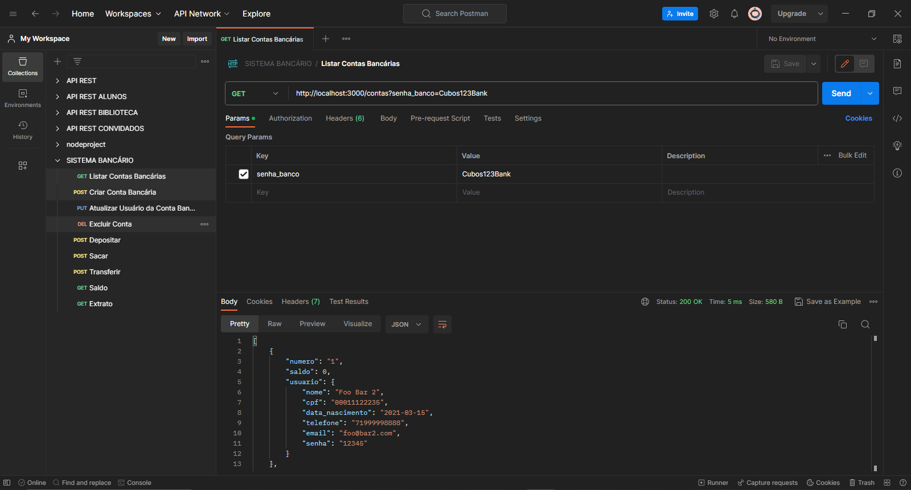
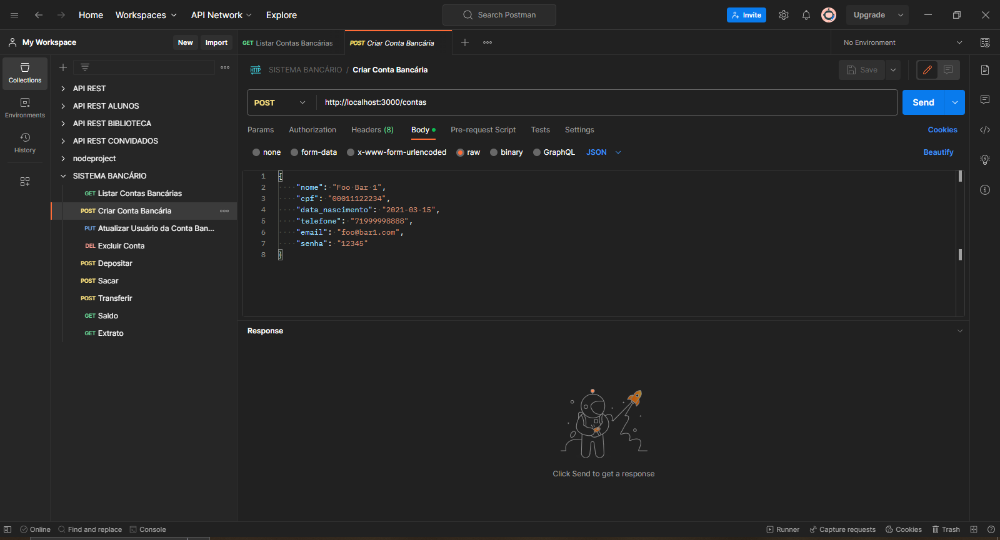
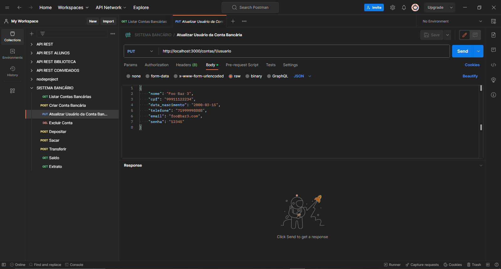
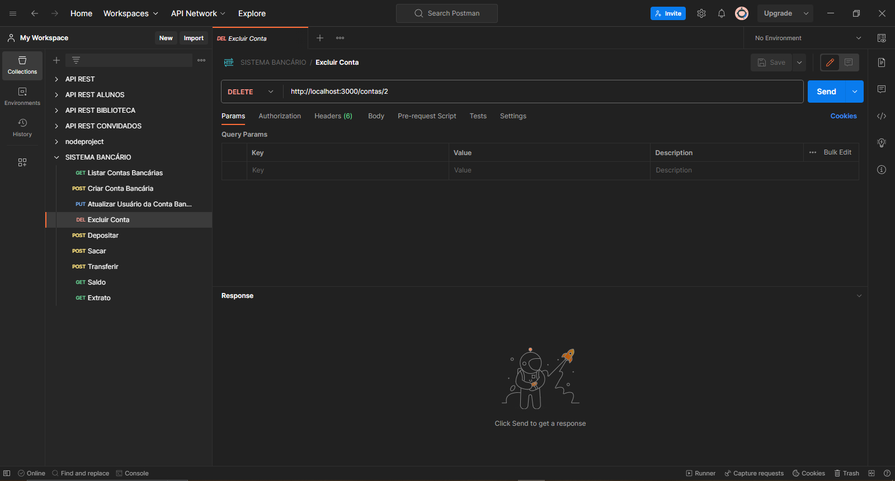
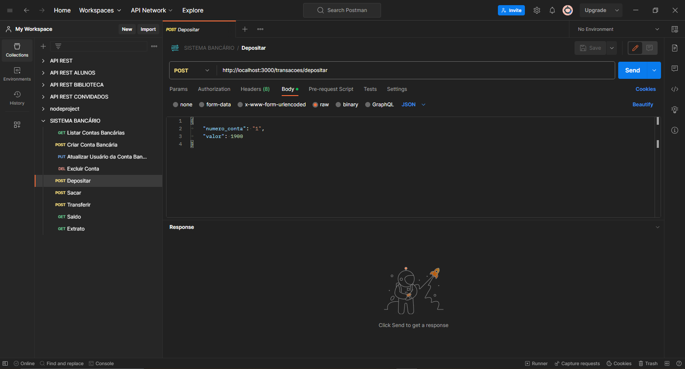
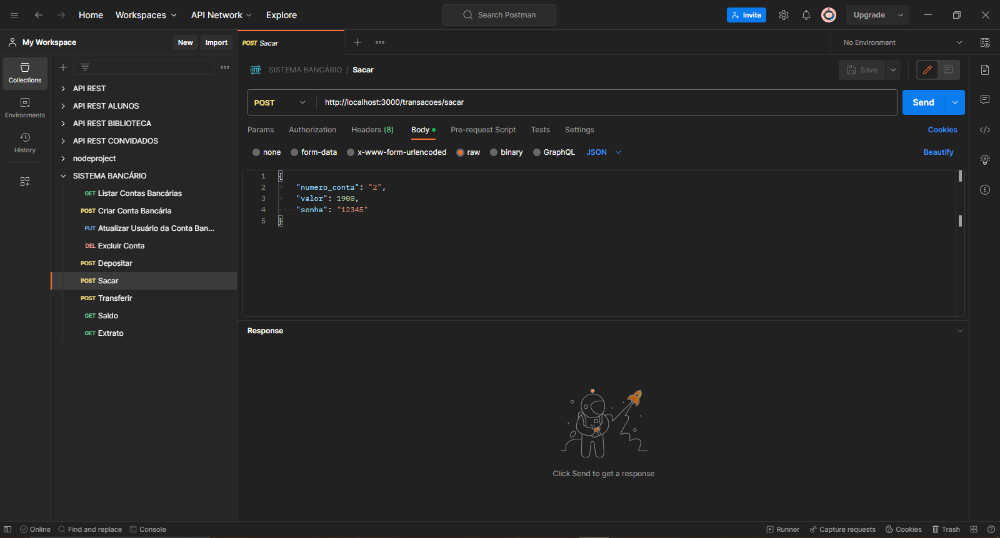
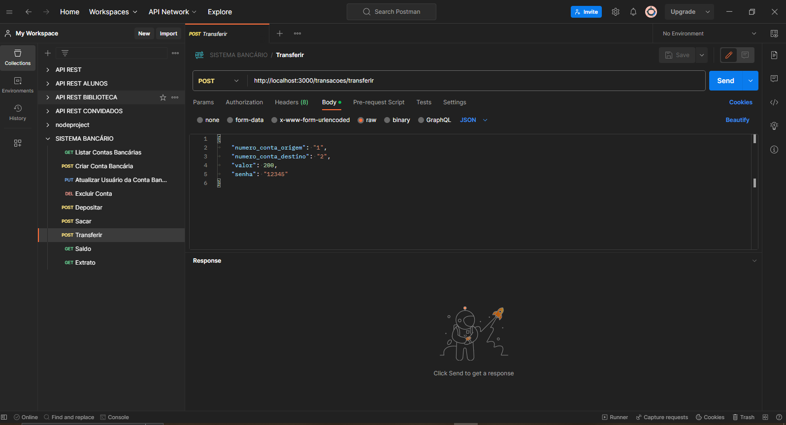
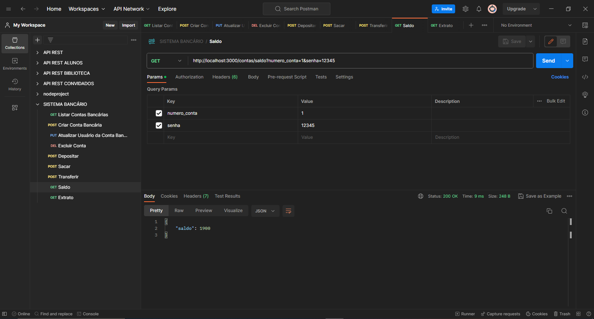
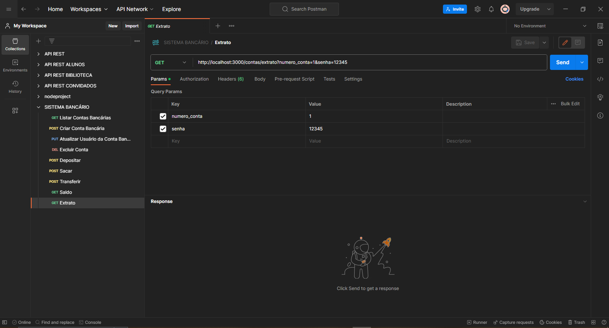

# Sistema-Bancário-API-REST

## Sobre:

API Rest para um sistema bancário, com operações CRUD (Create, Read, Update e Delete). A linguagem utilizada para desenvolver a API foi o JavaScript com Node.js utilizando os pacotes Express, nodemon e data-fns.

## Funcionalidades:

🔹 Criar conta bancária </br>
🔹 Listar contas bancárias </br>
🔹 Atualizar os dados do usuário da conta bancária </br>
🔹 Excluir uma conta bancária </br>
🔹 Depósitar em uma conta bancária </br>
🔹 Sacar de uma conta bancária </br>
🔹 Transferir valores entre contas bancárias </br>
🔹 Consultar saldo da conta bancária </br>
🔹 Emitir extrato bancário </br>

## Como executar:

1. Faça o fork do projeto e em seguida clone para sua máquina.
2. Abra o VSCode na pasta clonada e digite este comando no terminal:
```bash
npm install
```
  Em seguida, todos os pacotes listados como dependências serão instalados e estarão na pasta node_modules.
  
3. Depois de instalado os pacotes, iremos digitar:
```bash
npm run dev
```
Com isso, teremos o servidor inicializado e para testar os endpoints utilize o Postman, Insomnia ou outros de sua escolha.

# Endpoints:

## Listar contas bancárias
http://localhost:3000/contas?senha_banco=Cubos123Bank



## Criar conta bancária 
http://localhost:3000/contas



## Atualizar os dados do usuário da conta bancária
http://localhost:3000/contas/:numeroConta/usuario



## Excluir uma conta bancária
http://localhost:3000/contas/:numeroConta



## Depositar em uma conta bancária
http://localhost:3000/transacoes/depositar



## Sacar de uma conta bancária 
http://localhost:3000/transacoes/sacar



## Transferir valores entre contas bancárias
http://localhost:3000/transacoes/transferir



## Consultar saldo da conta bancária
http://localhost:3000/contas/saldo?numero_conta=1&senha=12342



## Emitir extrato bancário
http://localhost:3000/contas/extrato?numero_conta=1&senha=12342



## Tecnologias utilizadas:

<div style="display: inline_block"></br>
  <div style="display: inline_block">
  
  
                   
</div>
